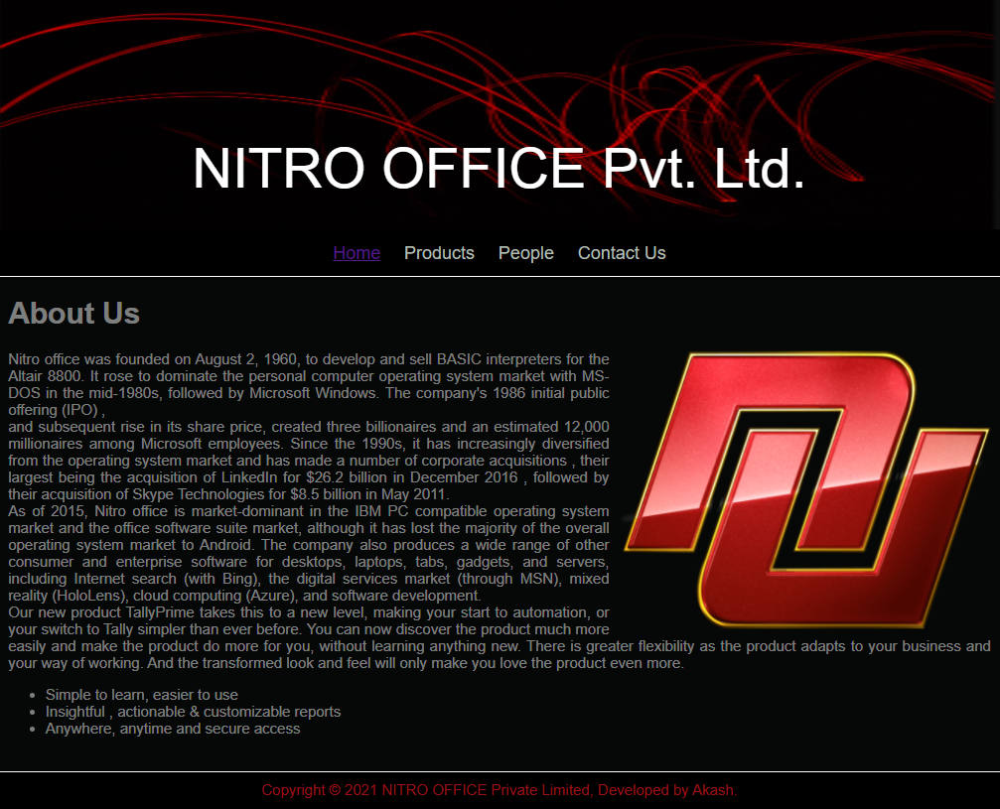
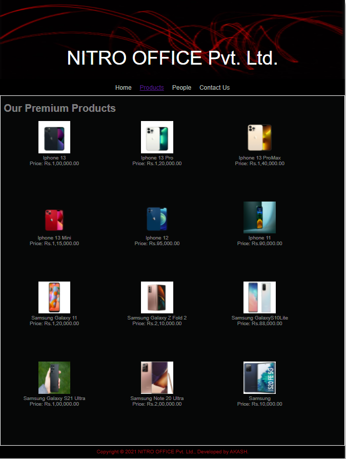
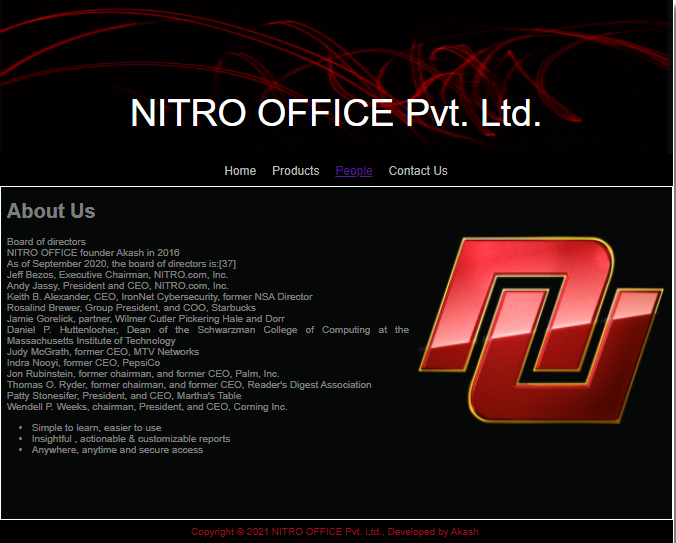
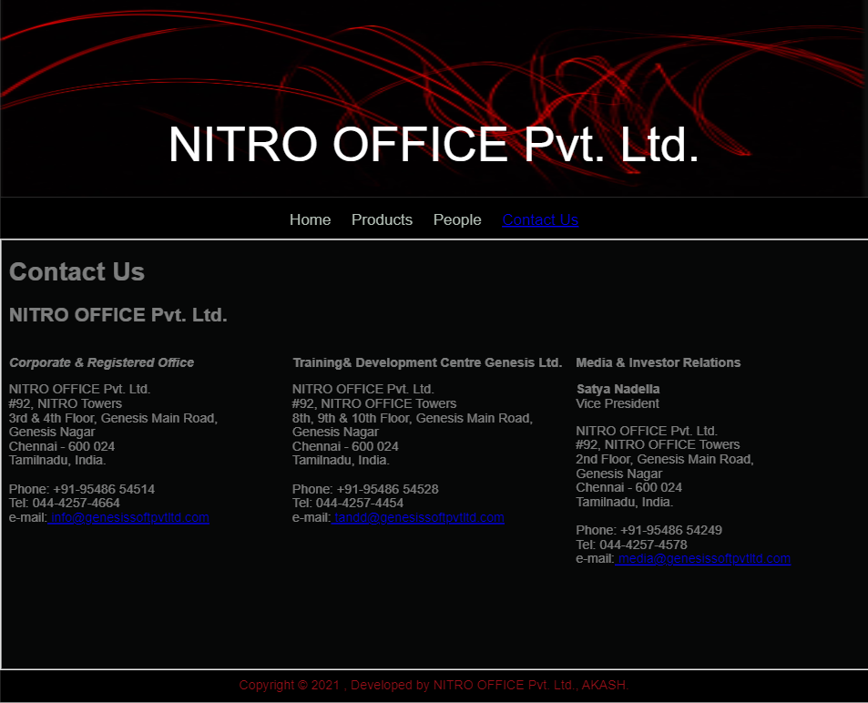

# Web Design for a Software Product Company

## AIM:

To design a static website for a software product company company.

## DESIGN STEPS:

### Step 1:

Requirement collection.

### Step 2:

Creating the layout using HTML and CSS.

### Step 3:

Updating the sample content.

### Step 4:

Choose the appropriate style and color scheme.

### Step 5:

Validate the layout in various browsers.

### Step 6:

Validate the HTML code.

### Step 6:

Publish the website in the given URL.

## PROGRAM :
1. HOME PAGE:
```
........................................<!DOCTYPE html>
<html lang="en">
  <head>
    <title>EduSoft Private Limited</title>
    <link rel="stylesheet" href="./css/layout.css" />
    <link rel="icon" href="./img/icon.png" type="image/x-icon" />
  </head>

  <body>
    <div class="container">
      <div class="banner">NITRO OFFICE Pvt. Ltd.</div>
      <div class="menu">
        <div class="menuitemselected"><a href="/static/home.html">Home</a></div>
        <div class="menuitem"><a href="/static/products.html">Products</a></div>
        <div class="menuitem"><a href="/static/People.html">People</a></div>
        <div class="menuitem"><a href="/static/contact.html">Contact Us</a></div>
      </div>
      <div class="content">
        <div class="homecontent">
          <h1>About Us</h1>
          
          <div class="contenttext">
            Nitro office was founded on August 2, 1960, to develop and sell BASIC interpreters for the Altair 8800.
             It rose to dominate the personal computer operating system market with MS-DOS in the mid-1980s, 
             followed by Microsoft Windows. The company's 1986 initial public offering (IPO)
             ,
             <br/>
             and subsequent rise in its share price, created three billionaires and an estimated 12,000 millionaires among Microsoft employees. 
             Since the 1990s, it has increasingly diversified from the operating system market and has made a number of corporate acquisitions
             , their largest being the acquisition of LinkedIn for $26.2 billion in December 2016
             , followed by their acquisition of Skype Technologies for $8.5 billion in May 2011.
             <br/>

            As of 2015, Nitro office is market-dominant in the IBM PC compatible operating system market and the office software suite market,
             although it has lost the majority of the overall operating system market to Android.
              The company also produces a wide range of other consumer and enterprise software for desktops, laptops, tabs, gadgets, and servers, including Internet search (with Bing),
               the digital services market (through MSN), mixed reality (HoloLens), cloud computing (Azure), and software development.
            <br />
            Our new product TallyPrime takes this to a new level, making your
            start to automation, or your switch to Tally simpler than ever
            before. You can now discover the product much more easily and make
            the product do more for you, without learning anything new. There is
            greater flexibility as the product adapts to your business and your
            way of working. And the transformed look and feel will only make you
            love the product even more.
            <ul>
              <li>Simple to learn, easier to use</li>
              <li>Insightful , actionable & customizable reports</li>
              <li>Anywhere, anytime and secure access</li>
            </ul>
          </div>
        </div>
      </div>
      <div class="footer">
        Copyright &#169; 2021 NITRO OFFICE Private Limited, Developed by Akash.
      </div>
    </div>
  </body>
</html>
```
2. PRODUCT PAGE:
```
<!DOCTYPE html>
<html lang="en">
  <head>
    <title>EduSoft Private Limited</title>
    <link rel="stylesheet" href="./css/layout.css" />
    <link rel="icon" href="./img/icon.png" type="image/x-icon" />
  </head>

  <body>
    <div class="container">
      <div class="banner">NITRO OFFICE Pvt. Ltd.</div>
      <div class="menu">
        <div class="menuitem"><a href="/static/home.html">Home</a></div>
        <div class="menuitemselected">
          <a href="/static/products.html">Products</a>
        </div>
        <div class="menuitem"><a href="/static/people.html">People</a></div>
        <div class="menuitem"><a href="/static/contact.html">Contact Us</a></div>
      </div>
      <div class="content">
        <div class="productcontent">    
          <h1>Our Premium Products</h1>
          <div class="productitems">
              <div class="productitem"> 
                  <div class="itemimage">
                  
                  </div>
                  <div class="itemname">Iphone 13</div>
                  <div class="itemprice">Price: Rs.1,00,000.00 </div>
              </div>
              <div class="productitem"> 
                  <div class="itemimage">
                  
                  </div>
                  <div class="itemname">Iphone 13 Pro</div>
                  <div class="itemprice">Price: Rs.1,20,000.00 </div>
              </div>
              <div class="productitem"> 
                <div class="itemimage">
                
                </div>
                <div class="itemname">Iphone 13 ProMax</div>
                <div class="itemprice">Price: Rs.1,40,000.00 </div>
              </div> 
              <div class="productitem"> 
                <div class="itemimage">
                
                </div>
                <div class="itemname">Iphone 13 Mini</div>
                <div class="itemprice">Price: Rs.1,15,000.00 </div>
              </div>
              <div class="productitem"> 
                <div class="itemimage">
                
                </div>
                <div class="itemname">Iphone 12</div>
                <div class="itemprice">Price: Rs.95,000.00 </div>
              </div>
              <div class="productitem"> 
                <div class="itemimage">
                
                </div>
                <div class="itemname">Iphone 11</div>
                <div class="itemprice">Price: Rs.90,000.00 </div>
              </div>
              <div class="productitem"> 
                <div class="itemimage">
                
                </div>
                <div class="itemname">Samsung Galaxy 11</div>
                <div class="itemprice">Price: Rs.1,20,000.00 </div>
              </div>
              <div class="productitem"> 
                <div class="itemimage">
                
                </div>
                <div class="itemname">Samsung Galaxy Z Fold 2</div>
                <div class="itemprice">Price: Rs.2,10,000.00 </div>
              </div>
              <div class="productitem"> 
                <div class="itemimage">
                
                </div>
                <div class="itemname">Samsung GalaxyS10Lite</div>
                <div class="itemprice">Price: Rs.88,000.00 </div>
              </div>
              <div class="productitem"> 
                <div class="itemimage">
                
                </div>
                <div class="itemname">Samsung Galaxy S21 Ultra</div>
                <div class="itemprice">Price: Rs.1,00,000.00 </div>
              </div>
              <div class="productitem"> 
                <div class="itemimage">
                
                </div>
                <div class="itemname">Samsung Note 20 Ultra</div>
                <div class="itemprice">Price: Rs.2,00,000.00 </div>
              </div>
              <div class="productitem"> 
                <div class="itemimage">
                
                </div>
                <div class="itemname">Samsung</div>
                <div class="itemprice">Price: Rs.10,000.00 </div>
              </div>  
          </div>
          </div>        
      </div>
      <div class="footer">
        Copyright &#169; 2021 NITRO OFFICE Pvt. Ltd., Developed by AKASH.
      </div>
    </div>
  </body>
</html>
```
3. PEOPLE PAGE:
```
........................................<!DOCTYPE html>
<html lang="en">
  <head>
    <title>EduSoft Private Limited</title>
    <link rel="stylesheet" href="./css/layout.css" />
    <link rel="icon" href="./img/icon.png" type="image/x-icon" />
  </head>

  <body>
    <div class="container">
      <div class="banner">NITRO OFFICE Pvt. Ltd.</div>
      <div class="menu">
        <div class="menuitem"><a href="/static/home.html">Home</a></div>
        <div class="menuitem"><a href="/static/products.html">Products</a></div>
        <div class="menuitemselected"><a href="/static/People.html">People</a></div>
        <div class="menuitem"><a href="/static/contact.html">Contact Us</a></div>
      </div>
      <div class="content">
        <div class="homecontent">
          <h1>About Us</h1>
          
          <div class="contenttext">
            Board of directors<br/>

            NITRO OFFICE founder Akash in 2016<br/>
            As of September 2020, the board of directors is:[37]<br/>
            
            Jeff Bezos, Executive Chairman, NITRO.com, Inc.<br/>
            Andy Jassy, President and CEO, NITRO.com, Inc.<br/>
            Keith B. Alexander, CEO, IronNet Cybersecurity, former NSA Director<br/>
            Rosalind Brewer, Group President, and COO, Starbucks<br/>
            Jamie Gorelick, partner, Wilmer Cutler Pickering Hale and Dorr<br/>
            Daniel P. Huttenlocher, Dean of the Schwarzman College of Computing at the Massachusetts Institute of Technology<br/>
            Judy McGrath, former CEO, MTV Networks<br/>
            Indra Nooyi, former CEO, PepsiCo<br/>
            Jon Rubinstein, former chairman, and former CEO, Palm, Inc.<br/>
            Thomas O. Ryder, former chairman, and former CEO, Reader's Digest Association<br/>
            Patty Stonesifer, President, and CEO, Martha's Table<br/>
            Wendell P. Weeks, chairman, President, and CEO, Corning Inc.<br/>
            <ul>
              <li>Simple to learn, easier to use</li>
              <li>Insightful , actionable & customizable reports</li>
              <li>Anywhere, anytime and secure access</li>
            </ul>
          </div>
        </div>
      </div>
      <div class="footer">
        Copyright &#169; 2021 NITRO OFFICE Pvt. Ltd., Developed by Akash.
      </div>
    </div>
  </body>
</html>
```
4. CONTACT US PAGE:
```
<!DOCTYPE html>
<html lang="en">
  <head>
    <title class="companyname">NITRO OFFICE Pvt. Ltd.</title>
    <link rel="stylesheet" href="./css/layout.css" />
    <link rel="icon" href="./img/icon.png" type="image/x-icon" />
  </head>

  <body>
    <div class="container">
      <div class="banner">NITRO OFFICE Pvt. Ltd.</div>
      <div class="menu">
        <div class="menuitem"><a href="/static/home.html">Home</a></div>
        <div class="menuitem"><a href="/static/products.html">Products</a></div>
        <div class="menuitem"><a href="/static/people.html">People</a></div>
        <div class="menuitemselected"><a href="/static/contactus.html">Contact Us</a></div>
      </div>
      <div class="content">
        <div class="productcontent">    
          <h1>Contact Us</h1>
          <h2>NITRO OFFICE Pvt. Ltd.</h2>
          <table width="100%" border="0" cellspacing="0" cellpadding="0">
            <tr>
              <td width="33%" valign="top">
                          <p>
                            <i>
                              <strong>Corporate & Registered Office</strong></i></p>
                              <p>NITRO OFFICE Pvt. Ltd.<br />
                               #92, NITRO Towers<br />
                               3rd & 4th Floor, Genesis Main Road,  <br/>
                               Genesis Nagar</br>
                               Chennai - 600 024<br />
                               Tamilnadu, India.<br /><br />
                               Phone: +91-95486 54514<br />
                               Tel: 044-4257-4664<br />
                               e-mail:<a target='_blank' href='mailto:info@genesissoftpvtltd.com?Subject=Enquiry for Genesis Software Pvt.Ltd.'> info@genesissoftpvtltd.com</a><br />
                              </p><br />
                </td>
              <td width="33%" valign="top">
              
               <p><strong>Training& Development Centre Genesis Ltd.</strong><br/> 
                    <p>NITRO OFFICE Pvt. Ltd.<br />
                     #92, NITRO OFFICE Towers<br />
                     8th, 9th & 10th  Floor, Genesis Main Road,  <br/>
                     Genesis Nagar</br>
                     Chennai - 600 024<br />
                     Tamilnadu, India.<br /><br />
                     Phone: +91-95486 54528<br />
                     Tel: 044-4257-4454<br />
                     e-mail:<a target='_blank' href='mailto:training@genesissoftpvtltd.com?Subject=Enquiry for Training & Development @ Genesis Software Pvt.Ltd.'> tandd@genesissoftpvtltd.com</a><br />
                    </p><br />
      </td>
              <td width="33%" valign="top">
              
               <p><strong>Media  & Investor Relations</strong><br/> <p> 
                                        
                                         <p><strong>Satya Nadella</strong> <br/>Vice President<p> 
                                         <p>NITRO OFFICE Pvt. Ltd.<br />
                                          #92, NITRO OFFICE Towers<br />
                                          2nd Floor, Genesis Main Road,  <br/>
                                          Genesis Nagar</br>
                                          Chennai - 600 024<br />
                                          Tamilnadu, India.<br /><br />
                                          Phone: +91-95486 54249<br />
                                          Tel: 044-4257-4578<br />
                                          e-mail:<a target='_blank' href='mailto:media@genesissoftpvtltd.com?Subject=Enquiry for Media and Related @ Genesis Software Pvt.Ltd.'> media@genesissoftpvtltd.com</a><br />
                                         </p><br />
                           </td>
            </tr>
          </table>
        </div>
      </div>
      <div class="footer">
        Copyright &#169; 2021 , Developed by NITRO OFFICE Pvt. Ltd., AKASH.
      </div>
  </body>
</html>
```
CSS LAYOUT SHEETS:
```
* {
  box-sizing: border-box;
  font-family: Arial, Helvetica, sans-serif;
}
body {
  background-color: whitesmoke;
  color: #ffffff7a;
}
.container {
  width: 1080px;
  margin-left: auto;
  margin-right: auto;
  border-width: 1px 1px 1px 1px;
  border-style: solid;
  box-shadow: 15px 15px 8px gray;
}

.banner {
  display: block;
  width: 100%;
  height: 250px;
  text-align: center;
  font-size: 60px;
  background-image: url("/static/img/background.png");
  background-size: 100% 100%;
  margin: 0px 0px 0px 0px;
  padding-top: 150px;
  color: #ffffff;
}

.menu {
  display: block;
  width: 100%;
  height: 50px;
  font-size: larger;
  background-color: #000000;
  text-align: center;
  padding-top: 15px;
  margin: 0px 0px 0px 0px;
  border-width: 1px;
}

.menuitem {
  display: inline-block;
  margin-left: 10px;
  margin-right: 10px;
}
.menuitemselected {
  display: inline-block;
  margin-left: 10px;
  margin-right: 10px;
  color: #000000;
}

.menuitem a {
  text-decoration: none;
  color: #B2BEB5
  ;
}

.content {
  display: block;
  width: 100%;
  background-color: #060707;
  min-height: 500px;
  margin: 0px 0px 0px 0px;
  border-width: 1px;
  border-color: white;
  border-style: solid;
}
.homecontent {
  min-height: 500px;
  margin: 10px 10px 10px 10px;
}
.homecontent h1 {
  text-align: left;
}
.homecontent img {
  float: right;
  width: 400px;
  height: 300px;
  margin-left: 10px;
}

.contenttext {
  text-align: justify;
}

.productcontent {
  min-height: 500px;
  margin: 10px 10px 10px 10px;
}

.productcontent h1 {
  text-align: left;
}

.productitems {
  display: block;
}

.productitem {
  display: inline-block;
  width: 30%;
  height: 250px;
  text-align: center;
}

.productitem img {
  width: 100px;
  height: 100px;
  display: block;
}
.productitem .itemimage {
  display: block;
  margin-left: auto;
  margin-right: auto;
  width: 100px;
  margin-bottom: 5px;
}

.productitem .itemname {
  display: block;
}
.productitem .itemprice {
  display: block;
}

.footer {
  display: block;
  width: 100%;
  height: 40px;
  background-color: #000000;
  text-align: center;
  padding-top: 10px;
  margin: 0px 0px 0px 0px;
  color: #9c1018;
}
```

## OUTPUT:

### Home Page:



### Products Page:



### People Page:



### Contact Us Page:



## Result:

Thus a website is designed for the software product company and the HTML,CSS code are validated.
